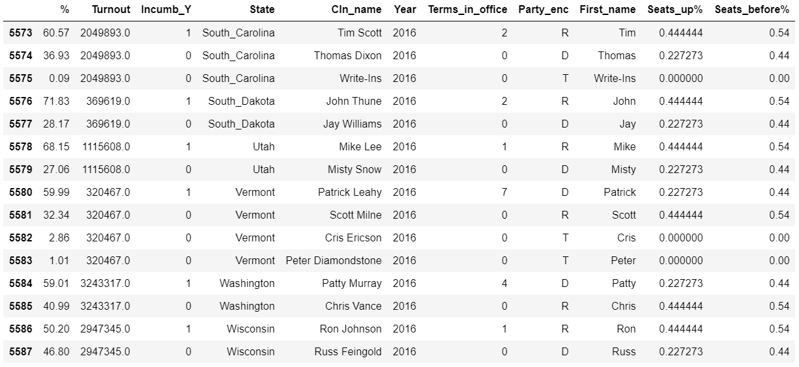
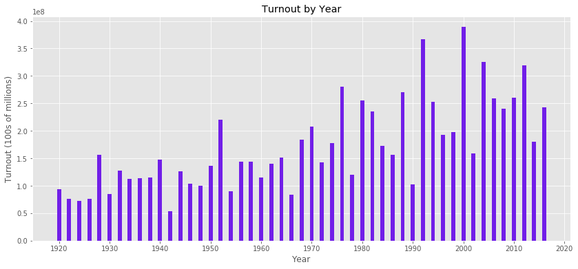
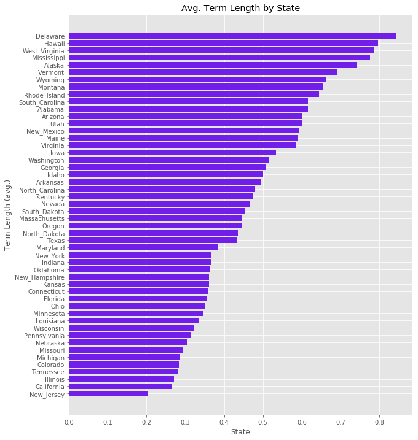
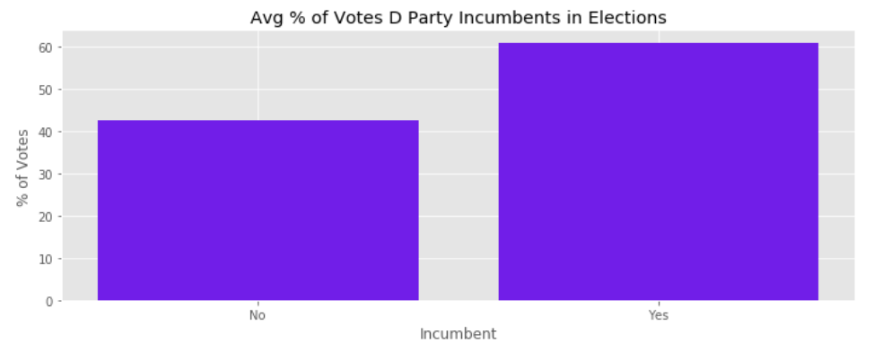
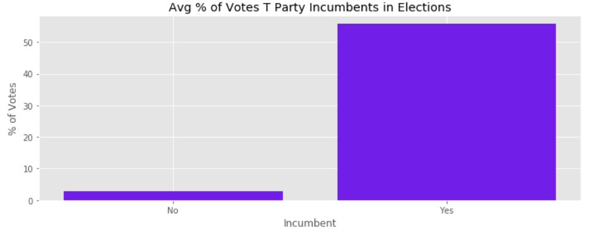
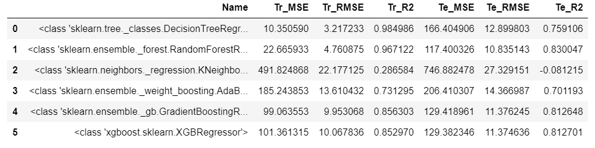
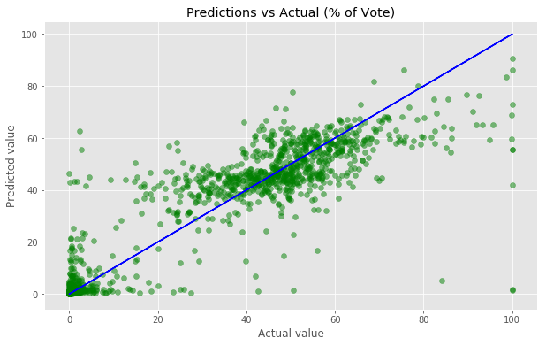
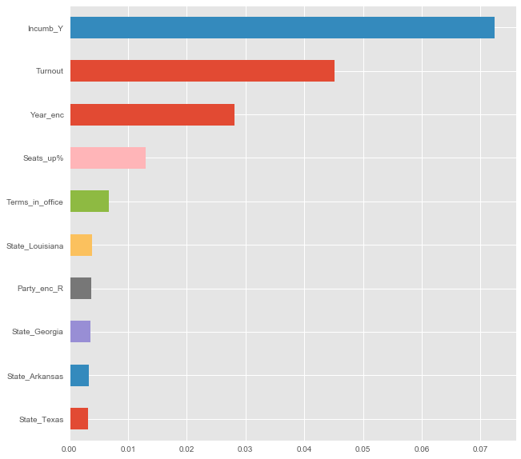

# Predict the Flip!
---

## Summary
---

To many, the United States' 2020 Senate elections are the most important in recent times. Besides how divisive they are politically, these elections will be held during a global pandemic without precedence. For these reasons, I wanted to leverage data science processes to see if past elections could help predict current (or even future) ones.

This project explored whether or not a machine learning model can be used to predict how much of the vote a given candidate will receive. In order to do so, I needed to create my own dataset directly from Wikipedia before using a random forest regressor from Scikit-Learn to get my results. The best model was able to achieve a RMSE of 10.86% and provide a number of insights about what is important for a candidate to get more votes.

Currently, the components of this project can be applied to benefit political parties, candidates, students, and/or educators in political or data science fields

## Tasks & Goals
---

For this project there were a few predetermined tasks and related goals that guided my focus during completion. 

### Project Tasks

* Make a machine learning model from supervised data
* Use free, public information
* Available for scraping on the internet

###  Project Goals

* Gather insights for candidates via EDA/modeling results
* Predict the winner of a state's senate general election
* Be able to use this dataset/model as part of a bigger project

## Data Sourcing
---

### Background

Although the United States' Senate has existed in some form since 1788, the U.S. Senate election process we know and recognize today came to fruition after the ratification of the 17th Amendment of the U.S. Constitution in 1913.

This Amendment made it so that the senators representing any given state needed to be elected by popular vote of the people, rather than being appointed by the state's legislature (unless it is an interim position until a special election is held).

Given this, the dataset will feature information beginning in 1914 through present. In some cases it will only feature 1920 through present as the acting senators during the ratification of the 17th Amendment were allowed to finish their six-year terms.

More information about this can be found here: [17th Amendment](https://en.wikipedia.org/wiki/Seventeenth_Amendment_to_the_United_States_Constitution)

### Process

After doing some research online, it became apparent that if I wanted to have all of the candidates that ran for office in a given year, I was going to need to create my own dataset from scratch.

The dataset used in this project was created by scraping various pages on Wikipedia containing information on past United States Senate elections with the BeautifulSoup package. I then used a number of custom cleaning/formattting functions to organize all of the information into a single CSV file. They all can be found in the *functions.py* file found in this repository. 

During the data collection process there were a few websites that inspired or helped to create this dataset. The Wikipedia page directly used to create the dataset is: [List of U.S. Senate Elections](https://en.wikipedia.org/wiki/List_of_United_States_Senate_elections)

The other links are:

* [Link to BallotPedia](https://ballotpedia.org/Legislative_Branch) (Original inspiration for project)

* [Link to Harvard Dataverse](https://dataverse.harvard.edu/dataverse/medsl_senate) (Inspiration for the structure of the dataset)

* [Link to Brookings](https://www.brookings.edu/multi-chapter-report/vital-statistics-on-congress/) (Inspiration for features, potential integration later)

* [Link to Wiki-Category (U.S. Senator)](https://commons.wikimedia.org/wiki/Category:Senators_of_the_United_States) (Inspiration for features, potential integration later)

### Results

The resulting CSV file contains:
* 5,588 datapoints
* Spans 96 years (1920-2016)
* Every candidate in senate general elections
* 8 total features

Below is what the resulting file looks like loaded in with the Pandas package:

### Features Explained

* `%` &mdash; Percentage of votes received by candidate in their respective election
* `Turnout` &mdash; Total amount of votes cast in respective election
* `Incumb_Y` &mdash; Binary variable indicating if a candidate is a current senator
* `State` &mdash; State seat that the election is for
* `Cln_name` &mdash; Cleaned version of candidate name
* `Year` &mdash; Year that election occurred
* `Terms_in_office` &mdash; Number of times candidate has been elected senator
* `Party_enc` &mdash; Encoded representation of candidate's party
    * **D** &mdash; Representation for the Democratic party 
    * **R** &mdash; Representation for the Republican party 
    * **I** &mdash; Representation for Independent party designation
    * **S** &mdash; Representation for the Socialist party
    * **T** &mdash; Representation for all other parties not included above (Third party)
* `First_name` &mdash; Split version of `Cln_name` (used in EDA)
* `Seats_up%` &mdash; Percentage of party's seats up for election in the current election cycle
* `Seats_before%` &mdash; Percentage of total seats in senate party had since prior election cycle

## EDA & Visuals
---

Normally, there would be a portion of cleaning prior to this stage, but due to my creation of the dataset I was able to minimize these steps during the collection stages. This allowed me to easily create a few simple visualizations that yielded some insights.

### Turnout

This year's election cycle (especially due to COVID) has brought a lot of attention to voter access. With this in mind I wanted to check what kind of information my dataset could provide on this.

> It is apparent that turnout has (on average) been increasing ever since there has been elections.

This could be due to many reasons, such as increases in population and/or literacy. Besides the gradual increase, it is clear that every decade (starting 1940) seems to have one cycle where turnout falls to about or below 150 million votes. This becomes more apparent post 1970, where turnout is mostly around 200 million, making it look even sharper of a drop.

### Average Term Length (by State)

I was curious to see if certain states were more or less likely to keep their senators once elected, as I encountered a few during my process that served over 6 terms. This may not seem like much, but a term for a U.S. senator can be either 4 or 6 years long, meaning some spent close to 50 years in their seat! 

> It is clear that some states tend to keep incumbent senators for longer (on average).

To my surprise, there are large differences between states in this category. In order to interpret these values, one must understand that a value will go up if this state has elections where:
 * There is a senator with 1+ terms involved (more the better)
 * There are not a lot of competitors, or the candidate runs unopposed.
 
Given this, its easy to see that a state like Delaware tends to keep it's senator around once they are in office and likely do not have much competition or a homogeneous political environment. On the other hand, a state like New Jersey must be highly contested and thus tend to cycle through senators. 

### Average Percent of Vote by Party

I had a feeling that being an incumbent senator would help one's prospects for re-election, but wanted to visually attempt to verify this. I decided to further slice by party to see if this had any effect upon the results.

#### Democratic Party

#### Republican Party

#### Third Parties

> Being an incumbent senator is *very important* to indicating the amount of votes one will receive in the following election. 

This matters the least if you are in the Democratic or Republican parties. The difference in vote percentage in these two parties is about 15-20% while the others show ~50% (if they have even had an incumbent). 

## Model Selection
---

### Initial Search

Due to the nature of my target variable, it was necessary that I use a regression algorithm for training and prediction. There were a total of 6 different models tested for use during training. They are:
* Decision Tree Regressor
* Random Forest Regressor
* K-Neighbors Regressor
* AdaBoost Regressor
* Gradient Boosting Regressor
* XBGRegressor

Here are the results:

The column I used to make my final decision is the `Te_RMSE`, as this represents the error on the testing (or validation) set. As the lowest of these came from the Random Forest Regressor, that is the one I stuck with.

### Final model

#### Prediction Performance

After doing some grid searching, I was able to achieve a testing RMSE of ~10.86% on a consistent basis. Given the natures of the features used for prediction, I am satisfied with this result as a starting point.

Below is a graph displaying the predicted against actual values from the testing data:

A few observations:
* ‘Mirrored’ low end
* Bottom-heavy upper bound
* Strong cluster in center

#### Feature Importances

One of the benefits of using Sci-Kit Learn's Random Forest Regressor is that you gain easy access to a attribute called `.feature_importances_`. This returns an array of values that:
* Represent the weight each feature has on the prediction value
* Does not indicate direction of weight (+/-) 
* Provides movement in a relative sense

This specific graph shows the top 10, without the #1 feature (it was significantly higher than the rest). **The #1 feature was `Seats_before%` with 0.75**. 

A few insights from this include:
* Timing is critical
* Prior year is most important
* Experience is crucial (incumbency/terms in office)
* Party does matter

## Conclusions
---

The training results from my model have uncovered some good insights that may be of use to any participating in this process and/or learning from it. I will be interpreting these results as-if someone in party leadership or a perspective candidate is looking to use this in their own election.

Some insights include:
* Experience is everything (Incumbency brings rewards)
* Majority rules (Party presence across nation)
* When is more important than where
* Voter participation is key
* Party selection is important for non-incumbents
